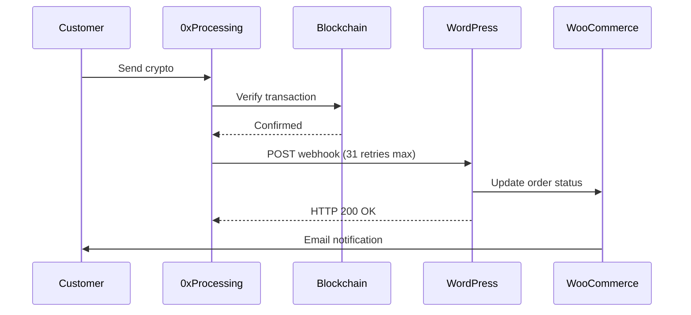

# WooCommerce Crypto Payment Gateway — 0xProcessing

[](https://www.gnu.org/licenses/gpl-3.0)
[](https://woocommerce.com/)
[](https://php.net/)
[](https://wordpress.org/)

Accept **Bitcoin, Ethereum, USDT, and 50+ cryptocurrency payments** in your WooCommerce store. A production-ready WordPress payment gateway plugin powered by [0xProcessing](https://0xprocessing.com) — HPOS compatible, multi-currency, with secure webhook integration.

## ✨ Features

- **50+ Cryptocurrencies Supported**: BTC, ETH, USDT (ERC20/TRC20/Polygon), USDC, BNB, SOL, TON, and more
- **HPOS Compatible**: Full support for WooCommerce High-Performance Order Storage
- **Multi-Currency Support**: Handles non-USD stores with automatic fiat conversion
- **Secure Webhook Integration**: MD5 signature verification with automatic retry handling
- **Test Mode**: Safely test payments without real transactions
- **Automatic Order Updates**: Real-time payment confirmations via webhooks
- **Insufficient Payment Handling**: Manual or automatic confirmation of underpayments
- **Database Tracking**: All payments logged in custom table for analytics
- **Admin Dashboard**: Payment details viewable in order admin pages
- **WooCommerce Subscriptions**: Manual-renewal support — customers receive invoice emails for each billing cycle and pay with crypto

## 📋 Requirements

- WordPress 5.8+
- WooCommerce 6.0+ (tested up to 9.0)
- PHP 7.4+
- SSL Certificate (HTTPS required for webhooks)
- 0xProcessing Merchant Account

## 🚀 Installation

### Option A: Download from GitHub (recommended)

1. Go to the [Releases](https://github.com/cyphercodes/woocommerce-crypto-payment-gateway/releases) page
2. Download the latest `.zip` file
3. In WordPress, go to **Plugins → Add New → Upload Plugin**
4. Upload the ZIP file and click **Install Now**
5. Click **Activate**

### Option B: Install via Git

```bash
cd /path/to/your/wordpress/wp-content/plugins/
git clone https://github.com/cyphercodes/woocommerce-crypto-payment-gateway.git wc-0xprocessing
```

Then activate the plugin in **Plugins → Installed Plugins**.

### Option C: Manual Upload

1. Download or clone this repository
2. Copy the plugin folder to `/wp-content/plugins/wc-0xprocessing/`
3. Activate through the **Plugins** menu in WordPress

### Step 2: Configure 0xProcessing Account

1. Register at [0xProcessing](https://0xprocessing.com)
2. Complete merchant onboarding
3. Navigate to **Merchant → API → General Settings**
4. Click **Generate API Key** (save it securely — it won't be shown again)
5. Note your **Merchant ID** (found in Settings → Merchant Management)
6. Set a **Webhook Password** for signature verification

### Step 3: Configure Webhook URL

1. In your 0xProcessing dashboard, go to **Merchant → API → Webhook URL**
2. Enter your webhook URL:
   ```
   https://yourdomain.com/wp-json/oxprocessing/v1/webhook
   ```
   ⚠️ **MUST be HTTPS** — webhooks require SSL/TLS
3. Set the **Webhook Password** (must match plugin settings)
4. Save settings

### Step 4: Configure Plugin

1. Go to **WooCommerce → Settings → Payments**
2. Click on **0xProcessing Crypto**
3. Configure:
   - **Enable**: ✅ Check to enable gateway
   - **Merchant ID**: Your 0xProcessing Merchant ID
   - **API Key**: Your 0xProcessing API Key
   - **Webhook Password**: Password for signature verification
   - **Test Mode**: Enable for testing (requires logged-in merchant session)
   - **Order Status**: Choose status after successful payment (Processing/Completed)

## 🔧 Usage

### Customer Flow

1. Customer adds products to cart and proceeds to checkout
2. Selects "Cryptocurrency via 0xProcessing" as payment method
3. Chooses preferred cryptocurrency from dropdown (BTC, ETH, USDT, etc.)
4. Clicks "Place Order"
5. Redirected to 0xProcessing payment form (30-50 minute window)
6. Pays via:
   - QR code (mobile wallet scan)
   - Manual wallet address copy
   - Web3 wallet connection (MetaMask, WalletConnect)
7. Automatically redirected back to store after blockchain confirmation
8. Order status updated via webhook within seconds

### Admin Flow

- View order payment details in order admin page
- Check transaction hash for confirmed payments
- Review payment status in order notes
- Handle insufficient payments through 0xProcessing dashboard

## 🔐 Security

### Webhook Signature Verification

All webhooks include a cryptographic signature verified using MD5 hash:

```php
// Signature string format (per 0xProcessing docs)
$string = "PaymentId:MerchantID:Email:Currency:WebhookPassword";
$signature = md5($string);
```

The plugin automatically verifies this signature before processing any webhook to prevent fraudulent callbacks.

### Best Practices

- ✅ Use strong webhook passwords
- ✅ Enable HTTPS (required by 0xProcessing)
- ✅ Keep API keys secure (never commit to git)
- ✅ Use test mode for development
- ✅ Monitor webhook logs regularly

## 📊 Payment Statuses

| Status | Description |
|--------|-------------|
| `pending` | Payment created, awaiting customer payment |
| `success` | Payment confirmed on blockchain and credited |
| `canceled` | Payment window expired without receiving funds |
| `insufficient` | Underpayment received, awaiting manual confirmation |

### Webhook Flow



## 📁 File Structure

```
wc-0xprocessing/
├── wc-0xprocessing.php          # Main plugin file (bootstrap)
├── uninstall.php                 # Cleanup on plugin deletion
├── README.md                     # This file
├── includes/
│   ├── class-wc-0xprocessing-api.php       # API client (HTTP wrapper)
│   ├── class-wc-0xprocessing-gateway.php   # Payment gateway logic
│   ├── class-wc-0xprocessing-webhook.php   # Webhook handler
│   └── class-wc-0xprocessing-database.php  # Custom DB table
├── assets/
│   ├── css/
│   │   ├── oxprocessing.css     # Frontend checkout styles
│   │   └── admin.css            # Admin dashboard styles
│   ├── js/
│   │   └── oxprocessing.js      # Frontend checkout scripts
│   └── img/
│       └── crypto-icon.svg      # Payment method icon
```

## 🗄️ Database Schema

### `wp_oxprocessing_payments`

| Column | Type | Description |
|--------|------|-------------|
| `id` | bigint | Auto-increment primary key |
| `order_id` | bigint | WooCommerce order ID |
| `payment_id` | bigint | 0xProcessing payment ID (unique) |
| `currency` | varchar(50) | Cryptocurrency used |
| `amount_fiat` | decimal(20,8) | Amount in store currency |
| `fiat_currency` | varchar(10) | Store currency code |
| `amount_crypto` | decimal(20,8) | Amount in cryptocurrency |
| `amount_usd` | decimal(20,8) | Amount in USD |
| `status` | varchar(50) | Payment status |
| `is_insufficient` | tinyint(1) | Underpayment flag |
| `tx_hashes` | text | JSON array of transaction hashes |
| `created_at` | datetime | Payment creation timestamp |
| `updated_at` | datetime | Last update timestamp |

## 🛠️ Troubleshooting

### Webhook Not Working

1. ✅ Verify your site uses HTTPS (required by 0xProcessing)
2. ✅ Check webhook URL in 0xProcessing dashboard exactly matches:
   ```
   https://yoursite.com/wp-json/oxprocessing/v1/webhook
   ```
3. ✅ Test WordPress REST API:
   ```bash
   curl https://yoursite.com/wp-json/
   ```
4. ✅ Check server logs for webhook POST requests
5. ✅ Enable `WP_DEBUG` to see detailed webhook logging

### Payment Not Creating

1. ✅ Verify API Key and Merchant ID are correct
2. ✅ Check API Key hasn't expired (regenerate if needed)
3. ✅ Review WooCommerce logs: `WooCommerce → Status → Logs → oxprocessing`
4. ✅ Ensure store currency is supported or can be converted to USD

### Test Mode Not Working

1. ✅ You must be logged into 0xProcessing merchant account
2. ✅ Test payments must be initiated from same browser session
3. ✅ Test webhooks have `Test=true` parameter
4. ✅ Test payments don't update real order statuses

## 🔌 Hooks & Filters

### Actions

```php
// Fires before processing webhook
do_action('oxprocessing_before_webhook', $data, $order);

// Fires after successful payment
do_action('oxprocessing_payment_success', $order_id, $webhook_data);

// Fires after canceled payment
do_action('oxprocessing_payment_canceled', $order_id, $webhook_data);
```

### Filters

```php
// Modify payment data before API call
$payment_data = apply_filters('oxprocessing_payment_data', $payment_data, $order);

// Filter supported currencies list
$currencies = apply_filters('oxprocessing_currencies', $currencies);

// Filter successful order status
$status = apply_filters('oxprocessing_order_status', 'processing', $order);
```

## 🎨 Customization

### CSS Custom Properties

All colors are configurable via CSS custom properties. Add overrides in your theme's stylesheet:

```css
:root {
    --oxp-accent: #your-brand-color;
    --oxp-accent-hover: #your-hover-color;
    --oxp-radius: 12px;        /* border radius */
}
```

Available variables: `--oxp-accent`, `--oxp-accent-hover`, `--oxp-text`, `--oxp-text-light`, `--oxp-bg`, `--oxp-bg-alt`, `--oxp-border`, `--oxp-radius`, `--oxp-status-success`, `--oxp-status-warning`, `--oxp-status-error`.

## 🐛 Development

### Enable Debug Logging

Add to `wp-config.php`:

```php
define('WP_DEBUG', true);
define('WP_DEBUG_LOG', true);
define('WP_DEBUG_DISPLAY', false);
```

Logs will be written to:
- `/wp-content/debug.log` (PHP errors)
- WooCommerce → Status → Logs → `oxprocessing` (plugin logs)

### Testing Webhooks Locally

Use [ngrok](https://ngrok.com/) to expose your local server:

```bash
ngrok http 8080
```

Update webhook URL in 0xProcessing dashboard to ngrok URL:
```
https://abc123.ngrok.io/wp-json/oxprocessing/v1/webhook
```

## 📝 Changelog

### Version 1.1.0

**New Features:**
- ✅ WooCommerce Subscriptions support (manual renewal mode)
- ✅ Switched webhook handler to use `payment_complete()` (WooCommerce best practice)
- ✅ Renewal orders no longer double-reduce stock

---

### Version 1.0.0 (Production Release)

**New Features:**
- ✅ Fixed-amount payment support
- ✅ HPOS compatibility (WooCommerce 7.1+)
- ✅ Multi-currency support (non-USD stores)
- ✅ Webhook signature verification (MD5)
- ✅ Database payment tracking
- ✅ Test mode with proper isolation
- ✅ Active currency filtering
- ✅ Gateway checkout icon

**Security Fixes:**
- ✅ Fixed settings crash when options don't exist
- ✅ Added HPOS-compatible order meta API
- ✅ Fixed activation hook DB class loading
- ✅ Webhook always returns HTTP 200 (per 0xProcessing docs)
- ✅ Added BillingID fallback for race conditions
- ✅ Test mode webhooks now properly isolated
- ✅ Removed duplicate email triggers
- ✅ Fixed stock release compatibility (older WC)

**Files Added:**
- `uninstall.php` — Clean database on plugin deletion
- `assets/img/crypto-icon.svg` — Payment method icon

## 📞 Support

- **0xProcessing Support**: support@0xprocessing.com
- **Documentation**: https://docs.0xprocessing.com
- **Plugin Issues**: Create an issue in repository

## 📄 License

GPL v3 or later — see [LICENSE](LICENSE)

## 👨‍💻 Credits

Built by [Rayan Salhab](https://github.com/cyphercodes) for the WordPress community. Integrates with [0xProcessing](https://0xprocessing.com) cryptocurrency payment processing.

## 🌟 Contributing

Contributions are welcome! Please see [CONTRIBUTING.md](CONTRIBUTING.md) for guidelines.